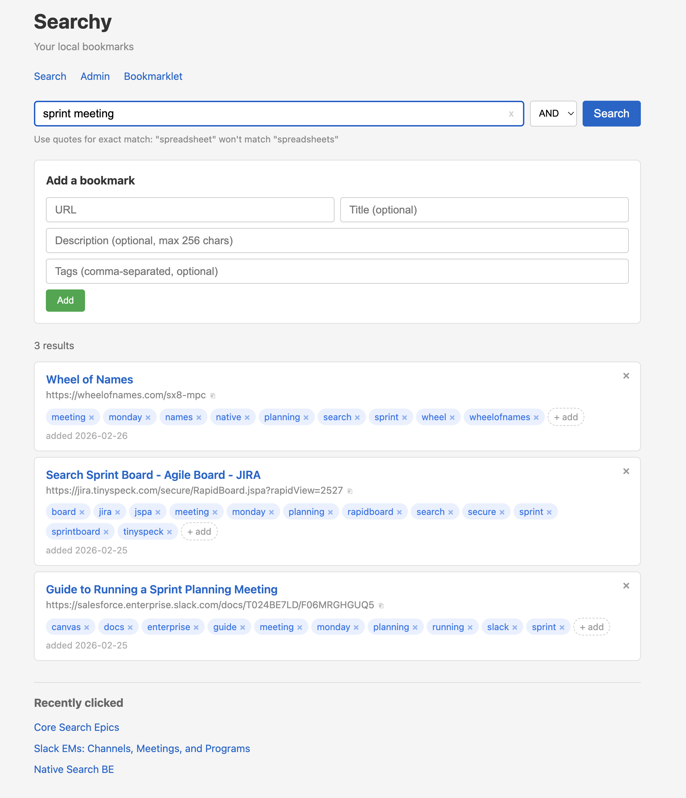

# Searchy

A local bookmarking service that stores links with tags in SQLite, provides search-by-tag with plural/singular matching, and supports browser bookmark import/export. Single-user, runs on macOS.



## Install

```bash
./install.sh
```

This creates a Python virtual environment, installs dependencies (`Flask`, `inflect`), and initializes the SQLite database.

## Run

```bash
./venv/bin/python3 app.py
```

Open [http://localhost:8080](http://localhost:8080).

## Pages

| URL | Description |
|-----|-------------|
| `/` | Search bookmarks by tag, add new bookmarks |
| `/admin` | List all bookmarks with inline editing, sorting, delete, import/export |
| `/bookmarklet` | Install a browser bookmarklet to save pages with one click |

## Architecture

```
searchy/
├── app.py                  Flask app with all routes
├── config.py               Constants (port, DB path)
├── db.py                   SQLite schema and connection management
├── models.py               All data access (CRUD, search, clicks, import/export)
├── url_utils.py            Extract words from URLs for auto-tagging
├── search_utils.py         Query parser with plural/singular variants
├── bookmark_parser.py      Netscape bookmark HTML parser
├── static/
│   ├── style.css           Styles
│   ├── app.js              Search page JavaScript
│   └── admin.js            Admin page JavaScript
└── templates/
    ├── index.html          Search page
    ├── admin.html          Admin page
    └── bookmarklet.html    Bookmarklet install page
```

### Stack

- **Backend**: Python + Flask on port 8080
- **Frontend**: Vanilla JS, no build step
- **Database**: SQLite with WAL mode

### Database schema

Four tables:

- **links** — `id`, `url` (unique), `title`, `date_added`, `last_clicked`
- **tags** — `id`, `name` (unique, lowercase)
- **link_tags** — junction table with `ON DELETE CASCADE`
- **click_history** — tracks every click with timestamp

### How search works

Queries are split into terms. Unquoted terms automatically match both singular and plural forms using the `inflect` library (e.g., searching `spreadsheets` also matches the tag `spreadsheet`). Quoted terms like `"spreadsheet"` match exactly.

- **AND mode** (default): results must match all terms (SQL `INTERSECT`)
- **OR mode**: results must match any term (SQL `UNION`)

### Auto-tagging

When a bookmark is added, words are extracted from the URL's hostname and path segments. Stopwords, short tokens, and non-alpha strings are filtered out. These become tags automatically, in addition to any user-provided tags.

## API

| Method | Path | Purpose |
|--------|------|---------|
| GET | `/api/search?q=...&mode=and\|or` | Search by tags |
| GET | `/api/links?sort_by=url\|title&order=asc\|desc` | List all links |
| POST | `/api/links` | Add link `{url, title?, tags?}` |
| PUT | `/api/links/<id>` | Update link fields |
| DELETE | `/api/links/<id>` | Delete link |
| POST | `/api/links/<id>/click` | Record a click |
| GET | `/api/history` | Last 5 distinct clicked links |
| POST | `/api/import/parse` | Parse bookmark HTML file upload |
| POST | `/api/import/save` | Save selected bookmarks from import |
| GET | `/api/export?format=json\|csv` | Download all links |
| POST | `/api/bookmarklet` | Add link (with CORS for bookmarklet) |

## Auto-start on login (macOS)

During installation you are prompted to install a LaunchAgent. If accepted, a plist is created at `~/Library/LaunchAgents/com.searchy.app.plist` and Searchy starts automatically on login.

```bash
# Stop Searchy
launchctl bootout gui/$(id -u) ~/Library/LaunchAgents/com.searchy.app.plist

# Start Searchy
launchctl bootstrap gui/$(id -u) ~/Library/LaunchAgents/com.searchy.app.plist
```

Logs are written to `searchy.log` and `searchy.err.log` in the project directory.

## Uninstall

```bash
./uninstall.sh
```

The uninstall script performs the following steps:

1. **Stops and removes the LaunchAgent** — unloads `com.searchy.app` from `launchctl` and deletes `~/Library/LaunchAgents/com.searchy.app.plist`.
2. **Stops running Searchy processes** — finds and kills any `python3 app.py` processes associated with this installation.
3. **Backs up the database** — copies `searchy.db` to a `searchy-db-backup/` folder with a timestamp (e.g. `searchy.db.20260221_161500`), then deletes the original.
4. **Removes the virtual environment** — deletes the `venv/` directory.
5. **Cleans up generated files** — removes `__pycache__/`, `searchy.log`, and `searchy.err.log`.

All source files (Python, templates, static assets, etc.) are left in place. To fully remove Searchy, delete the project directory after running the uninstall script.

## Dependencies

Only two external packages:

- `Flask>=3.0`
- `inflect>=7.0`

Everything else uses the Python standard library.
